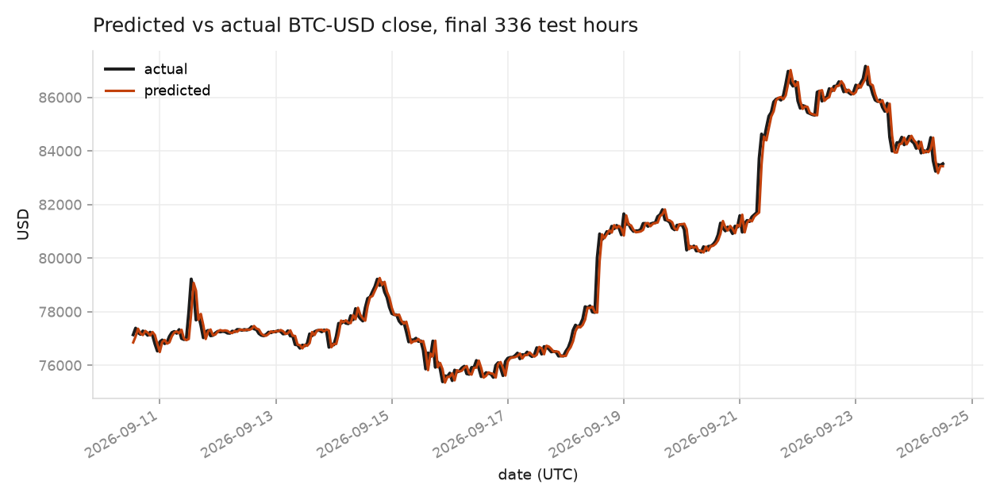
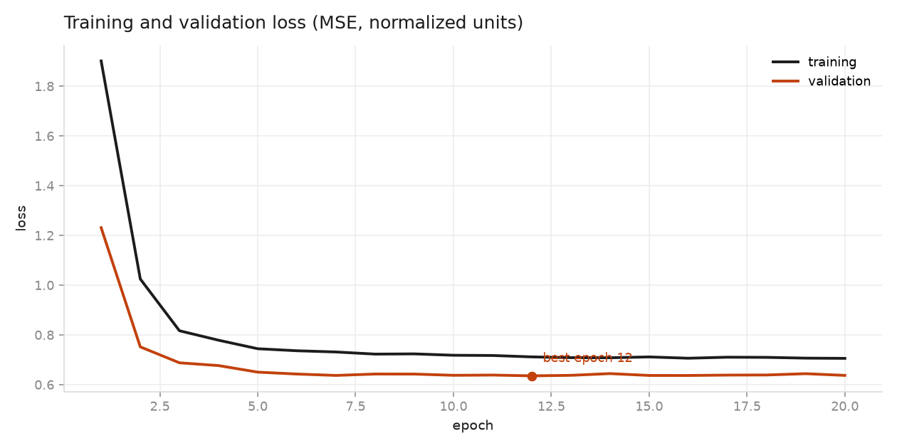
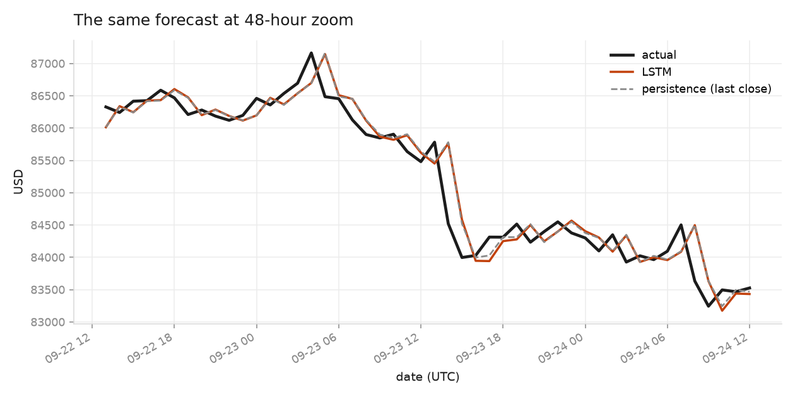
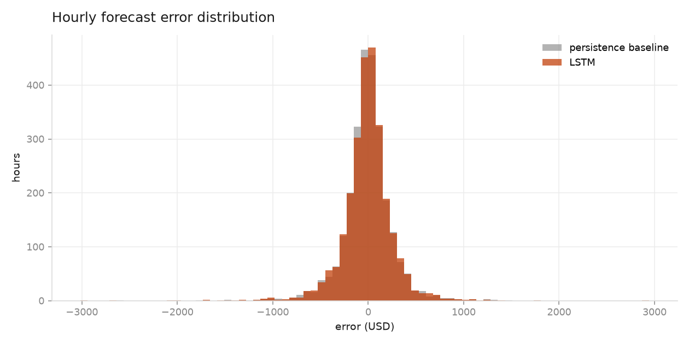

# I Trained an LSTM to Forecast Bitcoin. It Tied With Doing Nothing.



*Predicted vs actual BTC-USD close over the last two weeks of my test set. Looks good, doesn't it? Hold that thought.*

That chart above is the first result I got, and for about ten minutes I thought I had something. The orange line sits on the black line almost the whole way. Two weeks of hourly Bitcoin prices, predicted by a model that had never seen them.

Then I zoomed in, and the whole thing fell apart. I'll get to that.

This is a write-up of what I built, what the data actually looks like when you test it instead of assuming, and why the honest answer to "can you predict Bitcoin with an LSTM" is less exciting than the chart suggests.

## What time series forecasting actually is

A time series is a sequence of measurements taken in order, where the order matters. Hourly Bitcoin prices, daily rainfall, weekly sales. Forecasting means using the values you've already seen to estimate values you haven't.

The thing that makes it different from ordinary supervised learning is that you can't shuffle your data. In image classification, a cat picture is a cat picture whether it's row 3 or row 30,000. In a time series, row order *is* the signal. Shuffle before you split and you'll train on Thursday to predict Wednesday, then wonder why your validation score is beautiful and your live performance is garbage. Every split has to be a cut along the time axis.

My setup: take the previous 24 hours of Bitcoin trading, predict the close price of the next hour.

## Stationarity, and why price isn't

A series is stationary if its statistical behaviour doesn't drift — roughly, the mean and variance you'd measure in one stretch match what you'd measure in another. Most classical forecasting assumes it, and neural networks quietly prefer it too, because a model that learned "prices live around $90,000" is useless the moment prices live around $60,000.

Bitcoin's price is emphatically not stationary. I ran an Augmented Dickey-Fuller test, which tests the null hypothesis that a series has a unit root and wanders without returning to any stable level:

| Series | ADF statistic | p-value | Verdict |
| --- | --- | --- | --- |
| Hourly close | −1.763 | 0.399 | not stationary |
| Log returns | −134.2 | ≈ 0 | stationary |

A p-value of 0.399 means I can't reject the null at all. The price wanders. You can see it without the test too: the mean close in the first half of my two-year window was **$96,732**, and in the second half **$80,309**.

Differencing fixes it. Once you look at log returns — the percentage change from one hour to the next — the same test returns a statistic of −134.2, about as stationary as you'll ever see. And the volatility of those returns is stable across the window: standard deviation 0.00493 in the first half, 0.00471 in the second.

That's the useful insight. The *level* of Bitcoin is unpredictable and drifting. The *behaviour* of Bitcoin — how much it typically moves in an hour — is remarkably consistent.

## Seasonality and cyclicity

Seasonality is a pattern that repeats on a fixed calendar period. Cyclicity is a pattern that repeats without a fixed period, like boom-and-bust cycles that run for two years or five, depending on the decade.

Crypto markets never close, so there's no opening bell to create the intraday shape you see in equities. But humans still sleep. I measured the mean absolute hourly return, in basis points, by day of week:

| Mon | Tue | Wed | Thu | Fri | Sat | Sun |
| --- | --- | --- | --- | --- | --- | --- |
| 38.2 | 35.4 | 34.0 | 34.6 | 35.5 | **17.7** | **24.0** |

Saturday moves less than half as much as Monday. The weekly cycle is real and it's driven by when people are at their desks. Across hours of the day the spread between the quietest and busiest hour is about 90% of the mean.

Worth being precise about what this does and doesn't give you: it's seasonality in *volatility*, not in *direction*. Knowing Saturday is calm tells you how big the move will be, not which way it goes. That distinction turned out to matter.

## Preprocessing: from 60 seconds to 1 hour

The raw feed from Coinbase is one candle per minute. I pulled two years of it — **1,050,295 minute bars** — and the first thing I did was throw 59 out of every 60 away.

Minute bars are mostly microstructure: bid-ask bounce, one impatient trader, a bot rebalancing. The information-to-noise ratio is terrible at that resolution. Aggregating to hourly bars gave me **17,497 hours**, where open is the first price of the hour, close the last, and volume the sum.

There's a second reason, and it's about what the model can see. An RNN reading a 24-step window sees 24 minutes of minute data — barely anything. The same 24 steps of hourly data cover a full day, including the overnight lull and the American session. Same sequence length, sixty times the context.

Then three more steps:

**Gap repair.** When an exchange reports no trades for an hour, that hour is missing from the feed. Time didn't stop, so I insert the hour, carry the last close forward, and record zero volume. Without this, a "24-hour window" could silently span three days, and the model would have no way to know.

**Per-window normalization.** This is the stationarity problem showing up in practice. I normalize each 24-hour window by its own mean and standard deviation, rather than by global statistics. A window from late 2024 sits near $96,000 and a window from 2026 sits near $80,000; normalized against their own levels, both become a picture of *shape* — this day drifted up, that day chopped sideways — which is comparable across the whole dataset. I keep each window's mean and standard deviation so predictions convert back to dollars for reporting.

**Chronological split.** 70/15/15 by time: 12,247 training windows, 2,625 validation, 2,625 test. Never shuffled across the boundary.

## Feeding the model with tf.data.Dataset

`tf.data.Dataset` is TensorFlow's input pipeline API. Rather than handing the model one big array, you describe a stream of examples and the transformations they pass through, and TensorFlow handles batching and memory while the GPU or CPU stays busy.

My pipeline is four operations:

```python
def make_dataset(x, y, training=False, batch=256):
    ds = tf.data.Dataset.from_tensor_slices((x, y))
    ds = ds.cache()
    if training:
        ds = ds.shuffle(min(8192, len(x)), reshuffle_each_iteration=True)
    ds = ds.batch(batch)
    return ds.prefetch(tf.data.AUTOTUNE)
```

`from_tensor_slices` turns the window array into a stream of individual `(24 hours, next hour)` pairs. `cache()` keeps them in memory after the first epoch, so the windowing work happens once instead of sixty times. `shuffle` with a buffer of 8,192 mixes the training examples every epoch, so a batch isn't 256 consecutive hours from the same afternoon — that matters, because neighbouring windows overlap by 23 of their 24 hours and are almost identical. `batch(256)` groups them, and `prefetch(AUTOTUNE)` lets TensorFlow prepare the next batch while the current one is still training.

The shuffle is only applied to training. Validation and test keep their natural order, because I want to plot them against time afterwards.

## The model

```python
tf.keras.Sequential([
    tf.keras.layers.Input(shape=(24, 2)),
    tf.keras.layers.LSTM(64),
    tf.keras.layers.Dropout(0.2),
    tf.keras.layers.Dense(1)
])
```

One LSTM layer with 64 units, dropout, one output. Adam at 1e-3, MSE loss, early stopping on validation loss with patience 8.

Two features per timestep: the normalized close and the log of volume. An LSTM suits this because it carries a hidden state across the sequence and its gates let it hold or discard information — useful when a 24-hour window contains one violent hour and twenty-three boring ones.

Why so small? I tried to be honest about what the data supports. The input is 24 steps long, so there's no long-range dependency for a deep stack to discover. With ~12,000 training windows that overlap heavily, a bigger model mostly memorises. Early stopping picked **epoch 12 of 20**, with validation loss already flattening, which says the capacity wasn't the binding constraint.

## Results

Here's the training curve:



Healthy enough. Validation loss bottoms out at 0.6357 and then drifts up as training loss keeps falling, which is what early stopping is for.

And here are the numbers on 2,625 held-out hours — about four months the model never saw. The comparison that matters is against a **persistence baseline**: the naive forecast that says next hour's close equals this hour's close.

| Metric | LSTM | Persistence baseline |
| --- | --- | --- |
| MAE | $180.73 | **$179.21** |
| RMSE | $285.47 | **$284.18** |
| Directional accuracy | 48.0% | — |

The LSTM is 0.8% *worse* than doing nothing. And it calls the direction of the next hour correctly 48% of the time — slightly worse than a coin flip.

Now back to that opening chart. Here's the same forecast, zoomed to 48 hours, with the baseline drawn in:



The orange line is my LSTM. The grey dashed line is "just repeat the last price." They're the same line. Both of them trail the black line by exactly one step.

That's what the model learned: output approximately the last value you saw. It's the optimal strategy under MSE when the next change is close to unpredictable, and my network found it in about twelve epochs. The impressive first chart was never showing skill. It was showing a lag, compressed until the lag was invisible.



The error distributions tell the same story — near-identical spread, centred on zero.

## What I take from this

The part I'd do differently is where I spent my time. I put most of it on the model and almost none on the baseline, and the baseline is what turned out to be informative. If I'd computed persistence on day one, I'd have known what number I had to beat before writing a single Keras layer. A result without a baseline isn't a result, it's a chart.

On forecasting Bitcoin specifically: I don't think hourly price direction is predictable from hourly price history, and this experiment is consistent with a market that's efficient at this timescale. If a 24-hour window of closes and volumes contained a reliable signal about the next hour, it would be arbitraged away by people with better data and faster machines than mine. The near-random-walk behaviour isn't a flaw in my pipeline, it's the finding.

What *does* look predictable is volatility. The weekly cycle is strong and consistent — Saturday is genuinely calmer than Monday, every week, across two years. A model predicting *how much* Bitcoin will move, rather than *which way*, is asking a question the data can actually answer. That's what I'd build next.

And the preprocessing was worth more than the architecture. The 60-second to 1-hour aggregation, the gap repair, the per-window normalization, the chronological split — each of those was a decision about what the model is allowed to see, and together they mattered more than the choice between an LSTM and a GRU ever would.

If you want to reproduce this, or check whether I've fooled myself somewhere, the code is here:

**https://github.com/Elvin100s/alu-machine_learning/tree/main/supervised_learning/time_series**

`fetch_data.py` pulls the raw candles, `preprocess_data.py` does the aggregation and windowing, `forecast_btc.py` trains the model, and `analyze_series.py` runs the stationarity and seasonality tests. The measured numbers are in `RESULTS.md`.

---

*Written as part of the Machine Learning Techniques course at the African Leadership University.*
